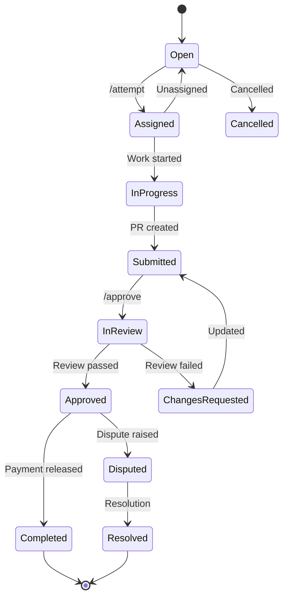

# Bounty Status State Machine

## Status Descriptions

| Status | Description |
|--------|-------------|
| Open | Bounty available for claiming |
| Assigned | Contributor claimed via /attempt |
| InProgress | Work in progress |
| Submitted | PR submitted for review |
| InReview | Maintainer is reviewing |
| Approved | Submission approved |
| Completed | Payment sent, done |
| Disputed | Conflict raised |
| Resolved | Dispute resolved |
| Cancelled | Bounty cancelled |
